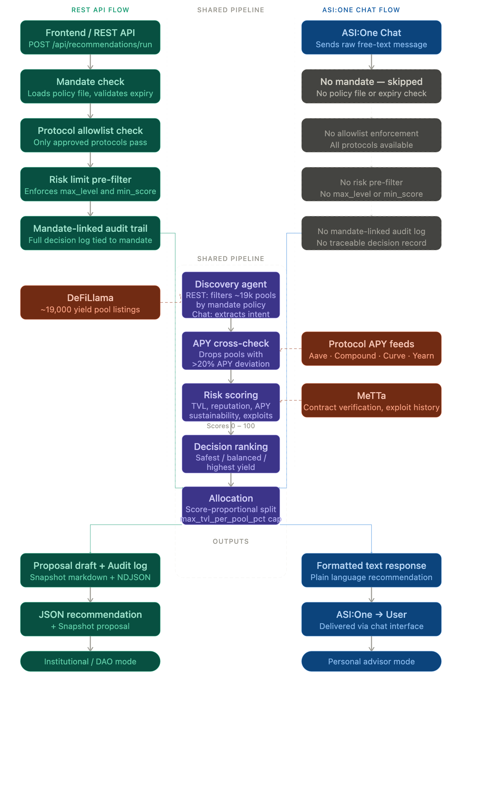

# Robo DeFi Advisor — DAO Treasury Management

**Launched here: https://www.producthunt.com/products/rda-robo-defi-advisor**

**Try it live: https://rdaadvisor.com/**

[](https://asi.foundation/)
[](https://github.com/fetchai/uagents)
[](https://agentverse.ai/)
[](https://python.org/)

---

Most DAO treasuries hold tens of millions of dollars in idle stablecoins — capital that earns nothing while governance deliberates how to deploy it safely. Robo DeFi Advisor (RDA) solves this by converting a DAO-approved mandate (risk limits, APY targets, approved protocols) into deterministic DeFi yield recommendations and Snapshot-ready governance proposals in seconds. The system scans ~19,000 pools across Aave, Compound, Curve, Uniswap, and others, filters by the mandate's exact constraints, scores each pool across four risk dimensions (TVL, protocol reputation, APY sustainability, exploit history), and allocates capital optimally — while keeping a liquid emergency reserve policy-enforced by design. Every recommendation is rule-based, fully explainable, bounded by the DAO-approved mandate, and logged to an immutable audit trail. **No funds ever move without a governance vote**: this is a proposal-generation system, not an execution engine.

---

## Architecture



---

## How the pipeline works

| Step | What happens |
|---|---|
| 1. Mandate check | Loads mandate by ID; blocks if expired or not found |
| 2. Policy validation | Validates `TreasuryPolicy` schema + protocol registry |
| 3. Discovery | Fetches ~19k pools from DeFiLlama; filters by mandate policy; ranks top-N by preference; cross-checks APY against protocol APIs |
| 4. Risk scoring | Scores each pool 0–100 (TVL + protocol tier + APY sustainability + exploit history); drops pools failing `risk.min_score` or `risk.max_level` |
| 5. Decision ranking | Normalises APY, risk score, and TVL; applies preference-based weights; picks optimal pool + alternatives |
| 6. Explanation | Adds rule-based "why selected" text to each pool for governance reviewers |
| 7. Allocation | Splits capital across recommended pools; respects `max_tvl_per_pool_pct`; drops < 2% slices |
| 8. Proposal draft | Generates Snapshot-compatible markdown proposal with full allocation table |
| 9. Audit log | Appends immutable NDJSON record: `run_id`, `mandate_id`, policy snapshot, output |

> **Chat flow**: when using ASI:One (`main.py`), free-text intent is extracted by the `asi1-mini` LLM (amount, APY, preference). Risk and Decision steps run identical logic; there is no mandate in this path.

---

## Decision Formula

RDA uses a **preference-aware deterministic formula** — same mandate + same data always returns the same ranking:

```
score = w_apy × norm_apy + w_risk × norm_risk_score + w_tvl × norm_tvl
```

Each variable is min-max normalized to `[0, 1]` across the candidate pool set. Weights vary by mandate `preference`:

| Preference | w_apy | w_risk | w_tvl | Optimizes for |
|---|---|---|---|---|
| `safest` | 0.15 | 0.65 | 0.20 | Lowest risk above all else |
| `balanced` | 0.40 | 0.35 | 0.25 | Yield balanced against safety and liquidity |
| `highest_yield` | 0.70 | 0.20 | 0.10 | Maximum APY within risk policy hard limits |

Different mandates with different `preference` values produce genuinely different pool rankings, even from the same candidate set.

---

## Security & Trust Model

AI in treasury workflows introduces real risk: bad recommendations, hidden model variance, and unauthorized execution.  
RDA addresses this with hard controls at every layer:

- **Mandate-gated**: every run requires a DAO-approved `mandate_id`; expired or missing mandates are blocked before any data is fetched
- **Policy as hard constraints**: APY bounds, risk limits, protocol allowlist, chain allowlist, and TVL caps are enforced — not suggestions
- **Deterministic, non-LLM ranking**: recommendation order is reproducible from an explicit formula; no hidden model variance
- **Proposal-only MVP**: the system cannot move funds; it returns recommendations + markdown drafts only
- **Registry-controlled protocols**: protocol names are validated through `core/protocol_registry.py` — unknown protocols are rejected
- **Explainability**: each pool includes explicit rule-based reasons for governance review committees
- **Audit trail**: every run logs `run_id`, `mandate_id`, policy snapshot, and output to an append-only NDJSON file

---

## Quick Start

**Prerequisites**: Python 3.11+, Node 18+

```bash
# Clone and install
git clone <repository-url>
cd Robo-DeFi-Advisor
python -m venv venv && source venv/bin/activate
pip install -r requirements.txt

# Environment variables (.env in project root)
ASI_ONE_API_KEY=your_asi_one_api_key
AGENTVERSE_API_KEY=your_agentverse_api_key

# Run backend API
uvicorn api.app:app --reload --port 8000

# Run frontend (separate terminal)
cd frontend && npm install && npm run dev

# Run tests
python -m pytest tests/
```

**For ASI Chat flow** (uAgent messaging), start agents in separate terminals:
```bash
python main.py                          # Treasury Agent
python agents/discovery_agent/agent.py
python agents/risk_agent/agent.py
python agents/decision_agent/agent.py
```

---

## API Reference

| Method | Endpoint | Description |
|---|---|---|
| `POST` | `/api/recommendations/run` | Run pipeline for a mandate |
| `POST` | `/api/mandates` | Create a new mandate |
| `GET` | `/api/mandates` | List all mandates |
| `GET` | `/api/mandates/{mandate_id}` | Get mandate detail |
| `GET` | `/api/runs/latest` | Latest run result |
| `GET` | `/api/runs/{run_id}` | Run result by ID |
| `GET` | `/api/audit/export` | Export audit log (NDJSON or JSON) |

The response includes `pipeline_stats` with per-stage pool counts (fetched → filtered → ranked → risk-checked → recommended) and run timestamps.

---

## Sample Output

Running `POST /api/recommendations/run` with `{ "mandate_id": "test-mandate-001" }` returns:

### Allocation (under `recommendation.allocation`)

```json
{
  "allocations": [
    {
      "protocol": "aave-v3", "chain": "Ethereum",
      "apy": 8.2, "risk_score": 82, "risk_level": "low",
      "pct": 40.0, "amount_usd": 40000.0, "tvl": 1200000000,
      "explanation": "APY 8.2% is within mandate bounds [3%–20%]. Protocol aave-v3 is on the approved list. Risk score 82 passes minimum 60."
    },
    {
      "protocol": "compound-v3", "chain": "Ethereum",
      "apy": 6.9, "risk_score": 78, "risk_level": "low",
      "pct": 35.0, "amount_usd": 35000.0, "tvl": 800000000,
      "explanation": "APY 6.9% is within mandate bounds. Protocol compound-v3 is on the approved list. Risk score 78 passes minimum 60."
    },
    {
      "protocol": "curve", "chain": "Ethereum",
      "apy": 5.4, "risk_score": 75, "risk_level": "low",
      "pct": 25.0, "amount_usd": 25000.0, "tvl": 500000000,
      "explanation": "APY 5.4% is within mandate bounds. Protocol curve is on the approved list. Risk score 75 passes minimum 60."
    }
  ],
  "expected_portfolio_apy": 7.14,
  "total_allocated_usd": 100000.0
}
```

### Proposal Draft (under `proposal_draft`) — paste directly into Snapshot

```markdown
## Treasury Allocation Proposal

Allocate **$100,000** from treasury across **3 pools**.

### Portfolio summary
- **Total allocated:** $100,000
- **Expected portfolio APY:** 7.14%
- **Number of pools:** 3

### Allocation breakdown

| Pool / Protocol | Chain    | Allocation | Amount  | APY  | Risk   | Verify      |
| --------------- | -------- | ---------- | ------- | ---- | ------ | ----------- |
| aave-v3         | Ethereum | 40.0%      | $40,000 | 8.2% | 82/100 | [View ↗](…) |
| compound-v3     | Ethereum | 35.0%      | $35,000 | 6.9% | 78/100 | [View ↗](…) |
| curve           | Ethereum | 25.0%      | $25,000 | 5.4% | 75/100 | [View ↗](…) |

### Selection rationale
- **aave-v3 (40%):** APY 8.2% within mandate bounds. Approved protocol. Risk score 82 ≥ minimum 60.
- **compound-v3 (35%):** APY 6.9% within mandate bounds. Approved protocol. Risk score 78 ≥ minimum 60.
- **curve (25%):** APY 5.4% within mandate bounds. Approved protocol. Risk score 75 ≥ minimum 60.

### Mandate & approval
- **Mandate ID:** test-mandate-001
- **Approval Ref:** dao-vote-2026-03-15
- **Generated At (UTC):** 18 Apr 2026, 10:30 UTC

_Generated by RDA Treasury Advisor. Review before publishing._
```

---

## Roadmap

**Phase 1 (implemented):** Policy-constrained discovery → risk scoring → deterministic decision → allocation → Snapshot proposal → audit log. No execution.

**Phase 2 (planned):**
- Multisig/timelock execution modules under explicit mandate limits
- Circuit-breaker and emergency withdrawal workflow
- Tamper-evident audit chain with optional on-chain anchoring
- Continuous APY monitoring and rebalance triggers with governance approval

The Phase 1 → Phase 2 split is deliberate: institutional trust requires proving policy discipline before enabling execution.

---

## Tech Stack

| Layer | Technology |
|---|---|
| Agent runtime | uAgents (Fetch.ai) |
| Agent registry | Agentverse |
| Identity & messaging | Fetch Network (DID, encrypted messages) |
| LLM (chat path only) | asi1-mini — intent extraction from free text |
| On-chain facts | MeTTa knowledge graph (fallback: formula scoring) |
| Pool data | DeFiLlama (~19k yield pools) |
| APY cross-check | Aave V3 / Compound / Curve / Yearn APIs |
| Backend | FastAPI + Python 3.11 |
| Frontend | React + Tailwind + React Query |

---

## Contributors & License

Built by [@truptisatsangi](https://github.com/truptisatsangi) — MIT License
